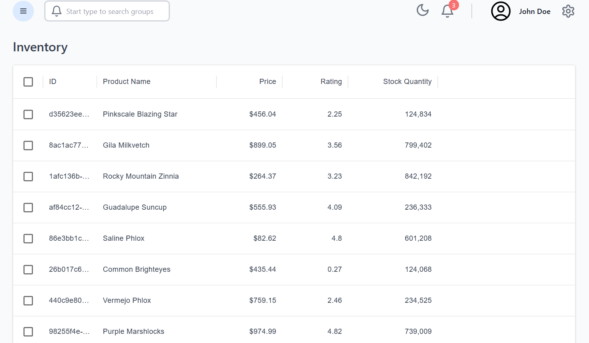
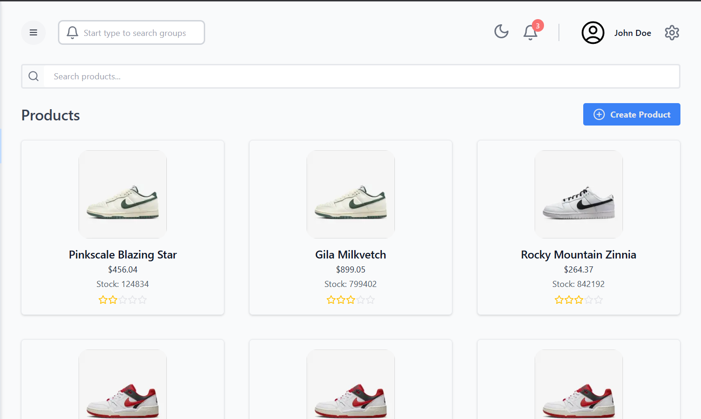
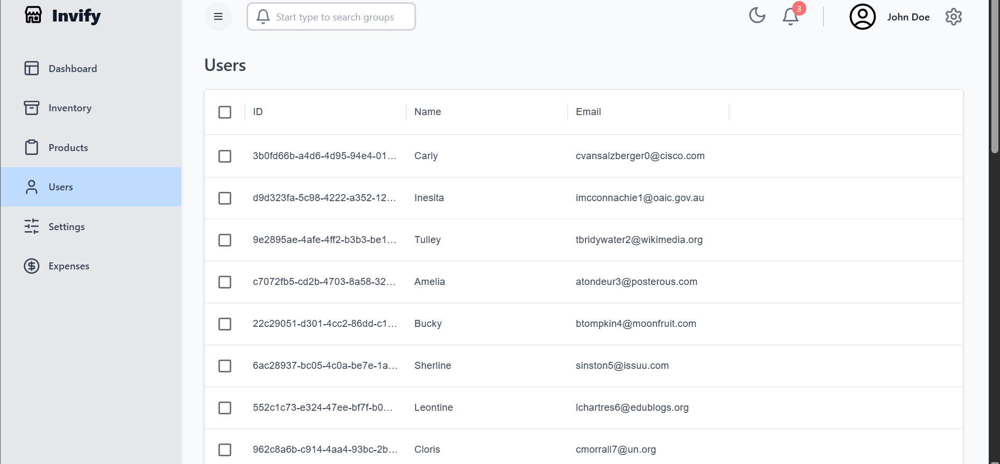
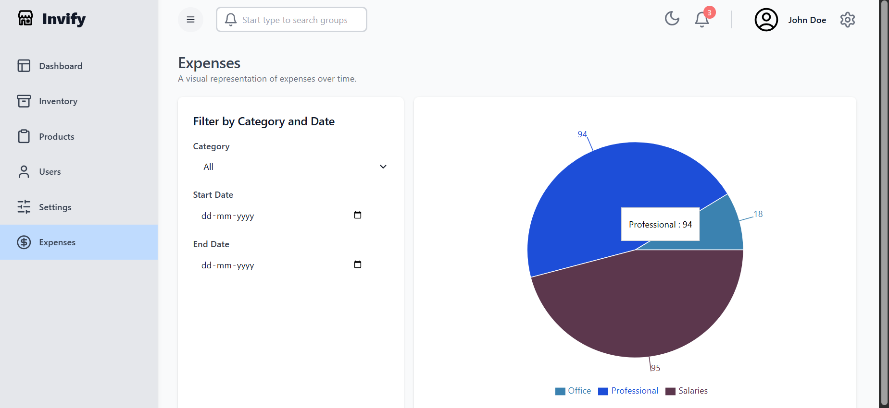
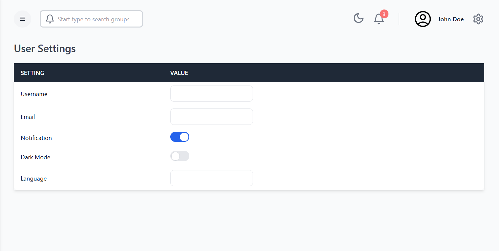

# 🧾 Invify

An end-to-end **inventory management system** built with a modern web stack, offering intuitive data visualization, CRUD capabilities, and seamless UX. The platform enables users to track products, manage expenses, view summaries, and interact with data through dynamic charts and tables.

The project is built using **Next.js** with **Tailwind CSS** on the frontend, and a **Node.js + Express** backend powered by **PostgreSQL** and **Prisma ORM**.

---

## 🧰 Tech Stack

### 🖥 Frontend
- **Next.js (TypeScript)** – React-based framework for performance and SSR.
- **Tailwind CSS** – Utility-first CSS framework for modern UI.
- **Redux Toolkit + RTK Query** – For efficient state and API data management.
- **Material UI Data Grid** – High-performance data tables.
- **Recharts** – Interactive and responsive data visualizations.

### 🔧 Backend
- **Node.js + Express** – RESTful API development.
- **Prisma ORM** – Type-safe database client for PostgreSQL.
- **PostgreSQL** – Relational DB for persistent data storage.

---

## 🚀 Features

### 📊 Dashboard Overview
- Unified view of key metrics across inventory, purchases, sales, and expenses.
- Built using **Recharts** to showcase real-time trends via pie, bar, and line charts.

---

### 📦 Inventory Management
- List and monitor available stock in real time.
- Includes search and filtering options to quickly locate items.

---

### 🛒 Products Interface
- Uses **Material UI’s Data Grid** for a clean, paginated product display.
- Supports adding new products directly via the UI.

---

### 👥 User Management
- View registered users in a sortable and searchable grid.
- Designed for quick admin access and overview.

---

### 💸 Expense Tracking
- Visual breakdown of expenses by category using pie charts.
- Includes filtering by date and category for granular analysis.

---

### ⚙️ Settings (Mock)
- Placeholder for user profile, theme toggles, and app preferences.
- Includes **dark mode** switch using global state via Redux.

---

## 🧠 Backend Highlights
- **Express API** serves product, user, sales, and expense data.
- **Prisma ORM** handles database models and relationships.
- Robust, scalable PostgreSQL schema with normalized relations.
